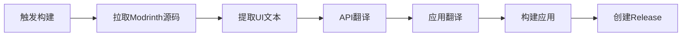

# 🌍 Modrinth App 自动翻译构建器

这个仓库提供了一个完全自动化的系统，用于从 [Modrinth官方仓库](https://github.com/modrinth/code) 拉取源码，自动翻译到多种语言，并构建多语言版本的Modrinth App。

## 🚀 特性

- 🔄 **自动拉取** Modrinth 官方最新源码
- 🔍 **智能提取** Vue组件中的1000+个UI文本
- 🌍 **多语言翻译** 支持中文、日语、韩语、法语、德语、西班牙语
- 🏗️ **自动构建** Windows .exe、macOS .dmg、Linux .AppImage
- 📦 **自动发布** GitHub Release包含所有平台版本
- 💡 **增量更新** 智能对比，只翻译新增和变更的文本

## 📊 支持的语言

| 语言 | 代码 | 状态 |
|------|------|------|
| 英语 | en-US | 原版 |
| 简体中文 | zh-CN | ✅ 自动翻译 |
| 日语 | ja-JP | ✅ 自动翻译 |
| 韩语 | ko-KR | ✅ 自动翻译 |
| 法语 | fr-FR | ✅ 自动翻译 |
| 德语 | de-DE | ✅ 自动翻译 |
| 西班牙语 | es-ES | ✅ 自动翻译 |

## 🎯 快速开始

### 1. Fork 这个仓库

点击右上角的 **Fork** 按钮

### 2. 配置 API 密钥

在你的 Fork 仓库中设置 GitHub Secrets：

```
Settings → Secrets and variables → Actions → New repository secret
```

添加以下 Secrets：

```
TRANSLATION_API_KEY = sk-your-openai-api-key
TRANSLATION_API_URL = https://api.openai.com/v1/chat/completions
```

### 3. 触发构建

#### 方法1: 手动触发（推荐）
```bash
# 在Actions页面点击 "Auto Translate Modrinth" workflow
# 然后点击 "Run workflow"
# 选择要构建的标签（如 v0.8.2）
```

#### 方法2: 定时触发
```bash
# 工作流每周自动检查官方仓库更新并构建
```

#### 方法3: 本地触发
```bash
gh workflow run auto-translate-modrinth.yml -f modrinth_tag=v0.8.2
```

### 4. 下载构建结果

构建完成后，在 **Releases** 页面下载多语言版本的 Modrinth App。

## 🛠️ 工作流程



1. **拉取源码**: 从 `modrinth/code` 拉取指定版本
2. **提取文本**: 扫描Vue组件，提取需要翻译的UI文本
3. **智能翻译**: 使用AI API翻译到目标语言
4. **应用翻译**: 将翻译结果整合到项目结构
5. **多平台构建**: 同时构建Windows、macOS、Linux版本
6. **自动发布**: 创建GitHub Release供下载

## 📁 项目结构

```
modrinth-auto-translator/
├── .github/workflows/
│   └── auto-translate-modrinth.yml    # 主工作流
├── scripts/
│   ├── setup-modrinth.js              # 源码拉取和设置
│   ├── extract-vue-translations.js    # 文本提取
│   ├── translate-api.js               # 翻译处理
│   └── apply-translations.js          # 翻译应用
├── configs/
│   ├── translation-config.json        # 翻译配置
│   └── language-mappings.json         # 语言映射
└── README.md
```

## ⚙️ 配置选项

### 翻译设置

编辑 `configs/translation-config.json`:

```json
{
  "targetLanguages": ["zh-CN", "ja-JP", "ko-KR", "fr-FR", "de-DE", "es-ES"],
  "batchSize": 15,
  "delay": 1500,
  "model": "gpt-3.5-turbo",
  "skipPatterns": ["css-class", "variable-name"],
  "includePatterns": ["ui-text", "error-message"]
}
```

### 构建设置

编辑工作流中的环境变量:

```yaml
env:
  MODRINTH_REPO: "modrinth/code"
  DEFAULT_TAG: "latest"
  TARGET_PLATFORMS: "windows,macos,linux"
```

## 🔧 开发和贡献

### 本地开发

```bash
# 克隆仓库
git clone https://github.com/your-username/modrinth-auto-translator
cd modrinth-auto-translator

# 安装依赖
npm install

# 设置环境变量
export TRANSLATION_API_KEY="your-api-key"
export MODRINTH_TAG="v0.8.2"

# 运行完整流程
npm run translate-and-build
```

### 测试翻译

```bash
# 只测试翻译功能
npm run test-translation

# 只测试文本提取
npm run test-extraction
```

### 添加新语言

1. 在 `configs/translation-config.json` 中添加语言代码
2. 在 `configs/language-mappings.json` 中添加语言映射
3. 测试翻译质量
4. 提交 Pull Request

## 📊 构建统计

- **源码拉取**: ~2-3分钟
- **文本提取**: ~1分钟
- **翻译处理**: ~10-15分钟（1000+字段×6语言）
- **应用构建**: ~15-20分钟（3平台并行）
- **总耗时**: ~30-40分钟

## 🐛 故障排除

### 常见问题

**Q: API配额不够怎么办？**
```bash
# A: 可以调整批处理大小和延迟
# 编辑 configs/translation-config.json
"batchSize": 10,
"delay": 2000
```

**Q: 某些文本翻译质量不好**
```bash
# A: 可以添加到跳过列表
# 编辑 configs/translation-config.json
"skipPatterns": ["technical-term", "brand-name"]
```

**Q: 构建失败**
```bash
# A: 检查Modrinth源码版本兼容性
# 查看Actions日志获取详细错误信息
```

### 调试模式

启用详细日志：

```yaml
# 在workflow中设置
env:
  DEBUG: "true"
  VERBOSE_LOGGING: "true"
```

## 🤝 贡献指南

欢迎提交Issue和Pull Request！

1. Fork项目
2. 创建功能分支 (`git checkout -b feature/amazing-feature`)
3. 提交更改 (`git commit -m 'Add amazing feature'`)
4. 推送分支 (`git push origin feature/amazing-feature`)
5. 开启Pull Request

## 📄 许可证

本项目采用 MIT 许可证 - 查看 [LICENSE](LICENSE) 文件了解详情

## 🙏 致谢

- [Modrinth Team](https://github.com/modrinth) - 提供优秀的开源项目
- [Tauri](https://tauri.app/) - 跨平台应用框架
- [OpenAI](https://openai.com/) - AI翻译服务

---

⭐ 如果这个项目对你有帮助，请给它一个Star！